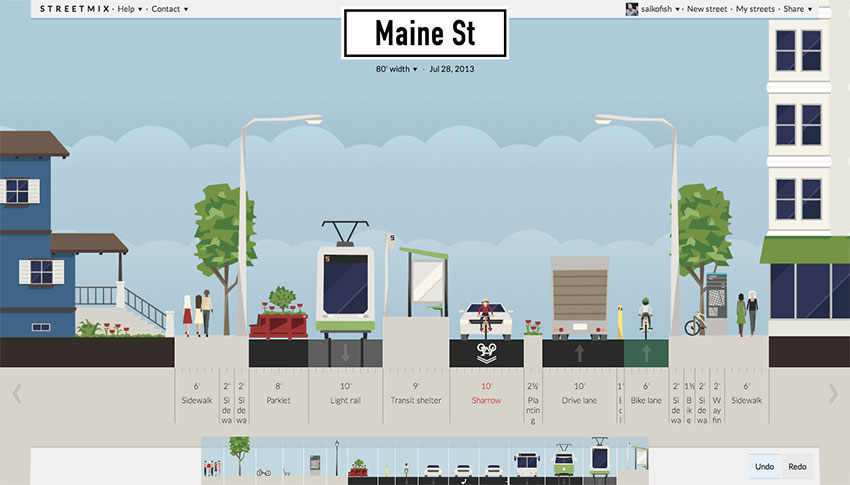

Streetmix
=========

Streetmix is a browser-based interactive tool that lets you design, remix, and share your neighborhood street.  Add trees or bike paths, widen sidewalks or traffic lanes, and learn how your decisions can impact your community.

Streetmix is currently live at http://streetmix.net/

## About

#### What are street sections?

A "section" is shortened way of saying "cross-section view", a type of 2D non-perspectival drawing commonly used in engineering and architecture to show what something looks like when you take a slice of it and look at it head-on. Similarly, a street section is a cross section view of a street, showing the widths and placement of vehicle lanes, bike lanes, sidewalks, trees, street furniture or accessories (like benches or street lamps), as well as engineering information like how the road is sloped to facilitate drainage, or the locations of underground utilities. Although sections can be simplified line drawings, urban designers and landscape architects have created very colorful illustrative street sections, removing most of the engineering particulars to communicate how a street could be designed to feel safe, walkable or habitable.

 Existing conditions section of Market Street, from the Better Market Street Plan, San Francisco (2) Proposed one-way cycletrack design of Second Street, from the Great Second Street Plan, San Francisco (3)Example of an illustrative section, courtesy of Lou Huang")

#### Why does Streetmix exist?

When city planners seek input from community meetings from the public on streetscape improvements, one common engagement activity is to create paper cut-outs depicting different street components (like bike lanes, sidewalks, trees, and so on) and allow attendees to reassemble them into their desired streetscape. Planners and city officials can then take this feedback to determine a course of action for future plans. By creating an web-based version of this activity, planners can reach a wider audience than they could at meetings alone, and allow community members to share and remix each other's creations.

The goal is to promote two-way communication between planners and the public, as well. Streetmix intends to communicate not just feedback to planners but also information and consequences of actions to the users that are creating streets. Kind of like SimCity did with its in-game advisors!

Streetmix can be used as a tool to promote and engage citizens around streetscape and placemaking issues, such as [Complete Streets][completestreets] or the Project for Public Spaces' [Rightsizing Streets Guide][rightsizing].

[completestreets]: http://www.smartgrowthamerica.org/complete-streets/complete-streets-fundamentals
[rightsizing]: http://www.pps.org/reference/rightsizing/

#### Why the name "Streetmix"?

"Streets" + "remix" :-)

#### How did this project start?

Streetmix was started as a [Code for America][cfa] hackathon project in January 2013, inspired by community meetings like the one described above, and a similar CfA project in 2012 called [Blockee](http://blockee.org/).

## Sponsors

## Credits

The team is comprised of 2013 Code for America fellows.

* [Ans Bradford][ans], media production
* [Ezra Spier][ahhrrr], cat herder, proto-urbanist
* [Katie Lewis][katie], illustrator
* [Lou Huang][louh], project lead, research, outreach, transit fan
* [Marc Hébert][marccfa], UX researcher, design anthropologist
* [Marcin Wichary][mwichary], UX, FE, PM, sharrow whisperer
* [Shaunak Kashyap][ycombinator], rear end engineering

[cfa]: http://codeforamerica.org/
[ahhrrr]: https://github.com/ahhrrr
[louh]: https://github.com/louh
[mwichary]: https://github.com/mwichary
[ans]: https://github.com/anselmbradford
[katie]: https://github.com/katielewis
[ycombinator]: https://github.com/ycombinator
[marccfa]: https://github.com/MarcCfA

You can contact the team at streetmix@codeforamerica.org.

Also, this project was made possible by the support of Code for America staff and other 2013 fellows, as well as our network of urbanists, design and planning professionals, and testers, who have provided us countless amounts of time and feedback towards this development.

### Copyright

Copyright (c) 2013-2016 Code for America. See [LICENSE][] for details.

[license]: https://github.com/codeforamerica/streetmix/blob/master/LICENSE.md
